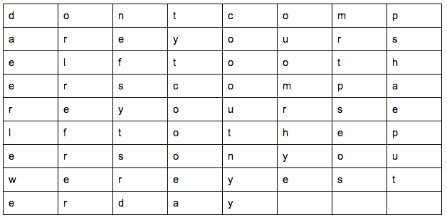

# Cryptosquare Encoder
#### Cryptosquare uses an algorithm to scramble a message
#### By Sean Pierce
_in collaboration with Sowmaya Dinavahi and James Higgins_

## Description
A classic method for composing secret messages is called a square code.

The spaces and punctuation are removed from the English text and the characters are written into a square (or rectangle) and the entire message is _downcased_. For example, the sentence **"don't compare yourself to others, compare yourself to the person you were yesterday"** is 69 characters long, so it is written into a rectangle with 9 rows and 8 columns.

[]

The coded message is obtained by _reading down the columns going left to right_, outputting encoded text in groups of _five letters_. For example, the message above is coded as:

**"daeer leweo rlref rerne fsyts rdtyt coooe acooo utnyy ouomr hyemr tpseo spsha eput"**

## Setup/Installation Requirements
* Clone, or download repo
* Open index.html in browser
* Or, visit https://seanpierce.github.io/cryptosquare
## Known issues
No known issues
## Technologies Used
* javascript/ jQuery
## Support and contact details
_sumler.sean@gmail.com_
### License
_MIT_
Copyright (c) _2017_ **Sean Pierce Sumler** _(for Epicodus)_
